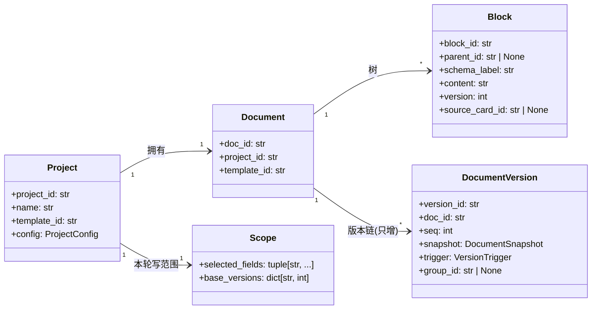
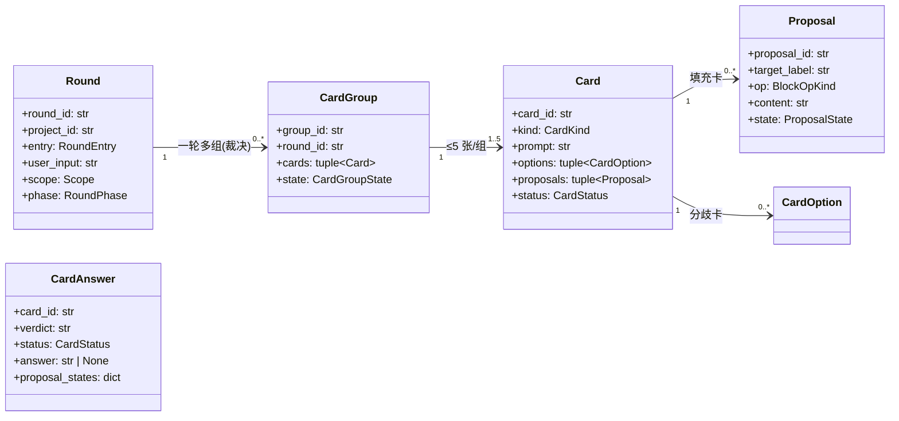
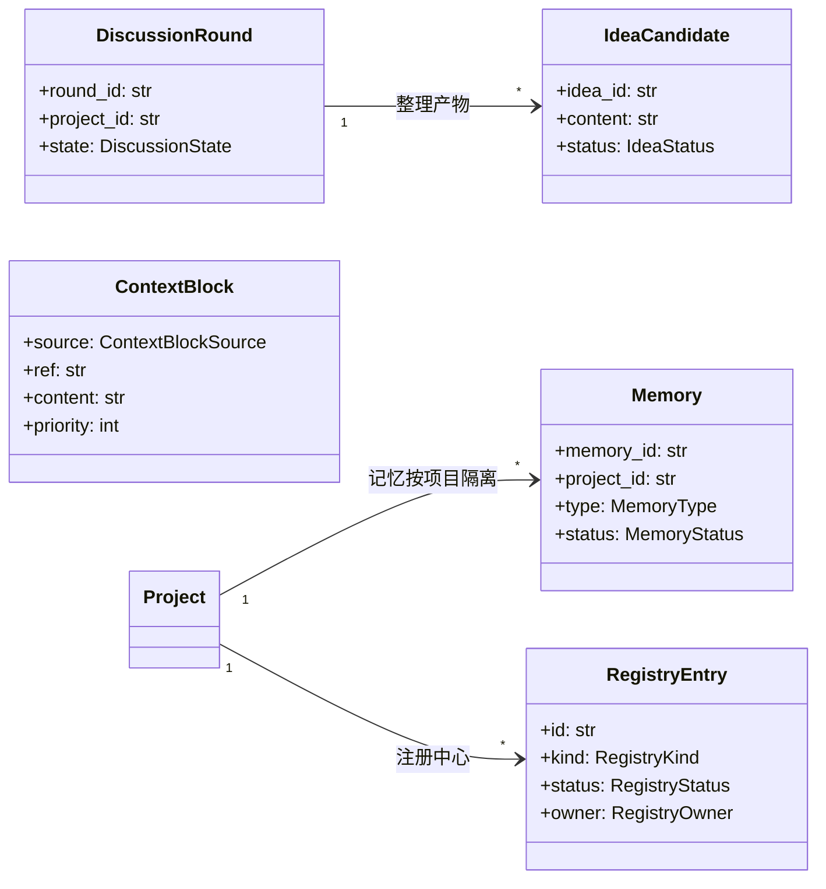
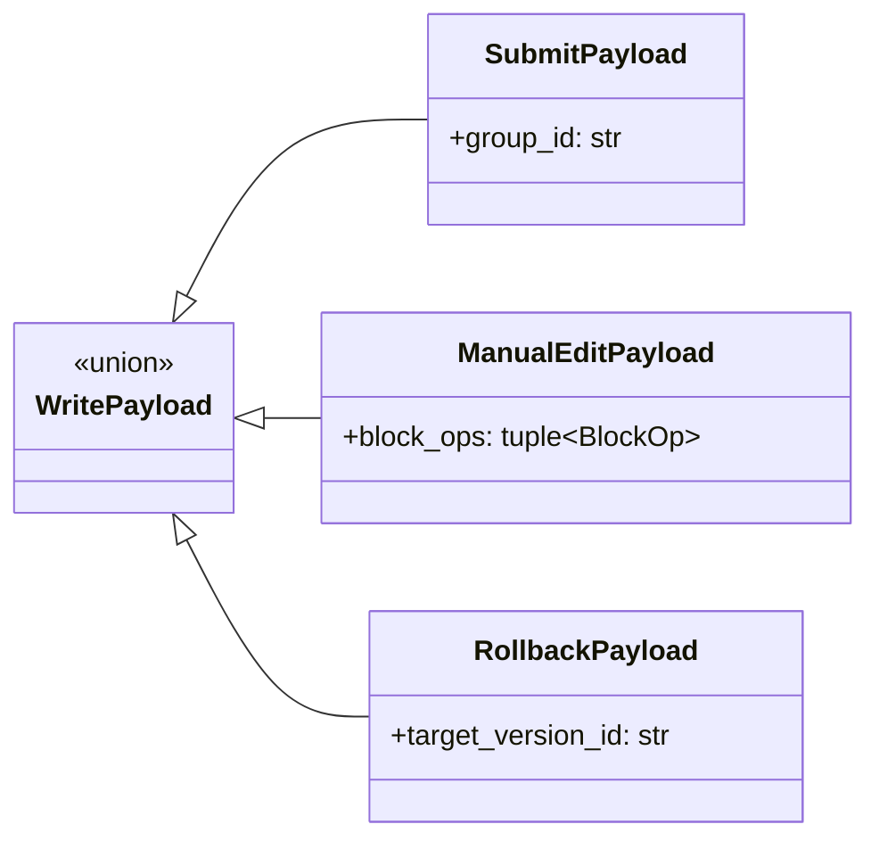

# 02 · 数据契约模型（v2 · DDD 聚合视角）

> 语义继承 C1–C17，v2 的关键变化：
> ① 领域逻辑收进聚合根；② 端口签名冻结（签名锁）；③ `write_document` 两参化；
> ④ 每个聚合有唯一不变量出处。

## 2.1 聚合总览

## 2.2 端口（Ports）与签名锁

端口定义在 `ports/` 层，方法签名冻结于 `contracts/frozen.py`；实现类必须通过签名比对测试（`test_port_signatures.py`）。

| 端口 | 关键方法 | 生产者 / 消费者 |
|---|---|---|
| `HarnessPort` | `complete(model_ref, messages, response_format=None)`；`trim(blocks, project_id, model_ref)` | L2/L4 → L6 |
| `AppServicesPort` | `write_document(trigger, payload) -> WriteDocumentResult`（**两参**） | 编排层 → L5 |
| `ContextAssemblerPort` | `assemble(project_id, round_id, entry, user_input) -> ContextRegion` | 编排层 → L4 |
| `BoardPort` | `write(region, value)` / `read(region)` | 编排层 ↔ L3 |
| `EventBusPort` | `publish(producer, event)` | 状态生产者 → L3 |
| `LedgerPort` | `create_document` / `append_version` / `list_versions` | L5 → L7 |
| `RegistryPort` | `get_active(kind, id)` / `list_active(kind)` | 全局 → L0 |
| `DrafterPort` | `draft(group, scope) -> DraftResult` | 编排层 → L2 |

**签名锁规则**：每个端口方法用 `inspect.signature` 与实现比对；实现允许「多一个可选参数」，但
「少参数 / 改默认 / 换返回类型」一律测试失败。改签名必须先写 `CR-xxx` 变更记录。

## 2.3 写入命令（v2 修正 D1）

`write_document(trigger: VersionTrigger, payload: WritePayload)`：
- `submit`：payload 只有 `group_id`；**M20 自己去黑板读这一组**，取 `state = kept` 的提案（对齐 CONTRACTS §5.3）。
- `manual`：`block_ops`，一次保存 = 一版。
- `rollback`：`target_version_id`，回退产生新版本、不删历史。

## 2.4 不变量唯一出处（D8 修复）

| 不变量 | 归属聚合 | 出处 |
|---|---|---|
| I17 写范围强制 | `Project` / `Scope` | `Scope.covers()` |
| I22 顶层字段唯一 | `Project` / `Document` | `Document.assert_unique_top_level_labels()` |
| I15/I16 卡片 ≤5、填充卡单独成批 | `Round` / `CardGroup` | `CardGroup._check()` |
| I8 版本只增不改 | `Project` / `DocumentVersion` | 存储层 + `DocumentVersion` |
| I9 一次改动 = 一版（事务） | `Project` | `LedgerPort` 实现 |
| I10 版本快照冲突检测 | `Project` / `Scope` | `DocumentWriter` 内部 |
| 事件窄发布（I?） | `EventBusPort` | `PRODUCERS` 白名单 |
| 终态相位 ↔ 结束原因配对 | `Round` | `enums.assert_phase_matches_reason` |

## 2.5 错误模型（v2 修正 D6）

| 异常 | HTTP 映射 | 语义 |
|---|---|---|
| `ContractViolation` | 400 | 契约不变量被破坏（业务侧错误） |
| `ValueError` | 422 | 参数形状错（API 层） |
| `GenerationFailure` | **503**（v2 新增） | 模型不可用 / 密钥缺失 / 服务超时，可恢复 |
| 其余未知异常 | 500 | 程序缺陷 |
