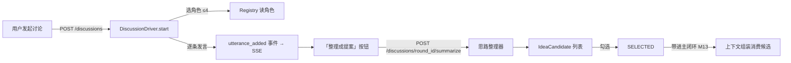

# 03 · 数据流

> 主闭环 + 讨论区两条链路，事件驱动状态变化，黑板承载跨层共享状态。
> 「同步调用拿结果、黑板共享状态、事件通知变化」三层机制不变。

## 3.1 主闭环数据流（端到端）

```mermaid
flowchart TD
    U[用户输入一句构思] -->|POST /rounds| RD[RoundDriver.start_round]

    subgraph ASSEMBLE [装配阶段]
        RD --> CA[ContextAssembler 组装上下文]
        CA -->|读| LEDGER[(Ledger: 文档/版本)]
        CA -->|读| BRIEF[(简报)]
        CA -->|读| MEM[(记忆)]
        CA -->|写| BOARD1[黑板 context 区块]
    end

    subgraph RESTATE [复述阶段]
        RD --> CG[Consensus 生成理解卡]
        CG -->|complete model| H[Harness 模型网关]
        CG -->|写| BOARD2[黑板 card_group 区块]
        BOARD2 -->|广播| EV1[card_group.updated]
        EV1 --> SSE[SSE 推送到前端]
    end

    subgraph VERDICT [裁决阶段]
        SSE --> USER2[用户在卡片界面回应]
        USER2 -->|POST /rounds/round_id/cards submit| RD2[RoundDriver.submit_cards]
        RD2 -->|confirm| CONFIRM[冻结卡片组]
        RD2 -->|correct| CORRECT[重新组装 → 重新生成]
    end

    subgraph DRAFT [成稿阶段]
        CONFIRM --> DR[Drafter 编排 kept 提案]
        DR -->|写| BOARD3[黑板 card_group 区块(填充卡)]
    end

    subgraph WRITE [写入阶段]
        BOARD3 -->|确认| DW[DocumentWriter.write_document(trigger=submit, payload={group_id})]
        DW -->|读黑板 group| BRD[读卡片组 kept 提案]
        DW -->|比对| VS[版本快照冲突检测 I10]
        DW -->|事务写| LEDGER2[(Ledger: 新版本)]
        LEDGER2 -->|广播| EV2[doc.changed]
        EV2 --> MEMINV[记忆失效链 M17]
        EV2 --> SSE2[SSE 文档更新]
    end

    subgraph DONE [收尾]
        SSE2 --> RD3[RoundDriver 收尾 → done]
    end

    U -.->|SSE 事件流| SSE
```

## 3.2 讨论区数据流



## 3.3 事件流（8 事件，窄发布）

| 事件 | 生产者 | 触发点 | 订阅者 |
|---|---|---|---|
| `round.updated` | orchestration | 开轮 / phase 变化 / 收尾 | 前端 SSE、记忆 |
| `card_group.updated` | orchestration | 卡片组出现 / 更新 / 冻结 | 前端 SSE、M20 |
| `doc.changed` | document_writer | AI 写入 / 手改 / 回退 | 前端 SSE、M17 失效链 |
| `discussion.utterance_added` | orchestration | 讨论区发言 | 前端 SSE、M29 |
| `memory.updated` | memory | 候选 / 晋升 / 失效 / 退役 | 前端 SSE、M13 |
| `registry.updated` | registry | 条目状态变化 | M10、前端 |
| `tool.invoked` | tools | 工具调用两端 | M25 观测 |
| `generation.failed` | harness | 模型失败 | 前端、重试 |

## 3.4 关键不变的数据流约束

1. **同步调用拿结果**：入参返回都是契约对象，没有「传一段自然语言给下一模块」。
2. **黑板承载共享状态**：`round` / `card_group` 区块写入即广播（`REGION_BROADCAST`）。
3. **事件只带「什么变了」+ 最小定位**：订阅者回黑板 / 存储读细节。
4. **I20 跨层纪律**：不给东西就调接口，要让别人知道变了就发事件，它自己回黑板读。
5. **写入路径唯一**：所有文档变更（AI / 手改 / 回退）都经 `DocumentWriterPort`，一次改动 = 一版。
