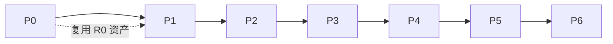

# 04 · 里程碑路线图（DDD + TDD）

> 每个里程碑都是「可验证的横切」，不是「按层竖切」。原则：**先 P0 地基 + P1 可运行 MVP，
> 再 P2–P6 逐边接实现**。每个里程碑有退出条件（可测试），TDD 红绿循环贯穿全程。

## P0 · 地基（DDD 骨架 + 漂移防御 + 可运行性）

| 项 | 内容 | 验证 |
|---|---|---|
| 包结构 | 迁移为 `domain / application / ports / infrastructure / api / bootstrap` | 现有 500+ 测试在新结构全绿 |
| 端口签名锁 | `inspect.signature` 比对协议与实现；负例测试（故意漂移必须被抓） | `test_port_signatures.py` |
| 装配类型化 | 删除 `object | None`，注入具体端口类型 | pyright 严格模式 0 error |
| 错误映射 | `GenerationFailure → 503` | API 测试无密钥不落 500 |
| Fake/Local Harness | 无密钥降级路径，本地默认模型 | 无 `DASHSCOPE_API_KEY` 全绿 |
| D1 修正 | `write_document(trigger, payload)` 两参化 | 三方一致测试 |

**TDD 第一步**：先写签名锁的失败测试（RED）→ 实现比对机制（GREEN）→ 重构。

## P1 · 可运行 MVP（主闭环端到端 + 最小前端）

范围：建项目 → 开轮 → 理解卡 → 填充卡 → 写入 → 版本可见，全程 SSE；
前端最小集 M1（项目容器）+ M2（文档编辑器只读 + 版本历史）+ M5（卡片界面）+ M3（最简目录树）。

**退出条件**：双击启动脚本 → 浏览器完成一次完整共识文档迭代（输入 → 复述确认 → 填充确认 → 文档多一版）；
无密钥路径用本地默认模型跑通全流程。

## P2 · 卡片机制补全（原 R2）

分歧卡（审查角色 + challenge）、信息卡（必填字段缺内容）、纠正路径（verdict = correct 重新组装）、
跳过落「待确认问题」、版本冲突出卡问用户、manual / rollback 写入路径。

**退出条件**：I15/I16 冻结语义全测通过；分歧可见；填充卡是提案数组。

## P3 · 讨论区（原 R3）

M7 讨论编排（选角色 ≤4、allowed_entries 过滤）、逐条发言事件、M29 整理候选、勾选、M13 组装时整批消费。

**退出条件**：讨论区接得上主闭环；「整理成提案」→ 勾选 → 带进上下文可复现。

## P4 · 记忆与上下文（原 R4）

M13 真组装（简报 / 历史 / 检索 / 记忆多来源）、M14 简报、M15 消息与滚动摘要、M16 检索、M17 候选记忆与失效链。

**退出条件**：记忆两态（候选 / 生效）；`doc.changed` 驱动的引用失效链走得通。

## P5 · 工具与权限（原 R5）

M18 联网搜索、M19 上传解析、M23 的 `can_use` / `can_enter`、M10 挑工具。

**退出条件**：功能组合 C 成立；I7（两档权限）；工具产出必带 ref（I4）。

## P6 · 复利与观测（原 R6–R7）

M30 候选 → 验证 → 晋升 / 退役（`registry.updated` 真正有人发）、M25 trace（主张留痕）与复盘。

**退出条件**：功能组合 D/E 成立；依据在复盘时查得到；重试路径。

## TDD 工作方式（贯穿）

1. 每个功能先写失败测试（描述期望行为，用 Fake 依赖隔离模型层）。
2. 最小实现让测试变绿；重构去重、收行为进聚合。
3. 端口签名锁作为「回归安全网」：任何签名漂移在 CI 立即失败。
4. 契约改动必须带 `CR-xxx` 变更记录，由测试执行（沿用现有 `frozen.py` 机制）。

## 里程碑依赖

